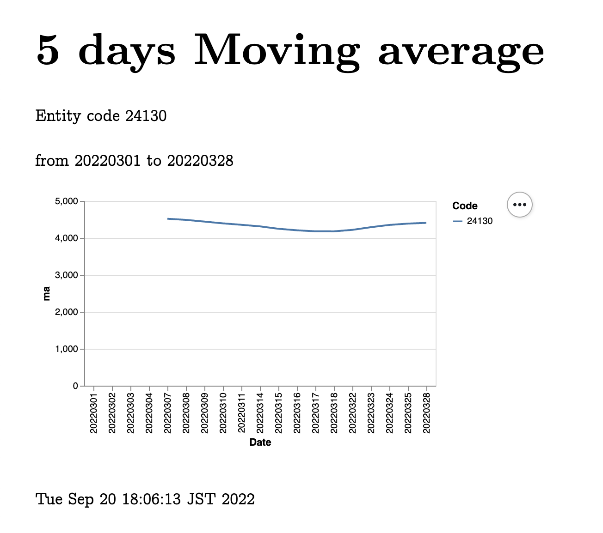

# hellonico/jquants-api-jvm

[](https://clojars.org/net.clojars.hellonico/jquants-api-jvm)

[](https://dl.circleci.com/status-badge/redirect/gh/hellonico/jquants-api-jvm/tree/master)




# Goal

jquants-api is a Clojure Wrapper around the [jquants api](https://jpx-jquants.com/).

It is hosted on [Clojars](https://clojars.org/net.clojars.hellonico/jquants-api-jvm).

The [jquants-api](https://jpx.gitbook.io/j-quants-api-en/api-reference/) propose a diverse set of daily financial data: 

- Listed Issue Information
- Stock Price Information
- Financial Information

With endpoints for each of them.

To use the jquants api, You first need to [register and create an account](https://application.jpx-jquants.com/register). 


To use this API, you need to either:
- use the login with your username and password, or
- create a login file as shown below:

```clojure
; In $HOME/.config/digima/login.edn
{:mailaddress "youremail@address.com" :password "yourpassword"}
```

The jquants-api specifies a refresh token and an id token to get and refresh but this wrapper will refresh those tokens as needed without the user having to do anything.

# Extra Code for the Wrapper

The wrapper creates a local cache to get daily quotes based on fuzzy search for the name of the entity to get the quotes from.

Meaning, instead of :

```clojure
(daily {:Code 86970 :date 20220118})
```

You can do:
```clojure
(daily-fuzzy {:CompanyNameEnglish "Japan Exchange" :date 20220118})

```

The returned data structure for either call is according the jquants api, turned into Clojure structure / maps with keywords as keys.


## Building


Invoke a library API function from the command-line:

    $ clojure -X hellonico.jquants-api/daily-fuzzy {:CompanyNameEnglish "KAWASE" :date 20220920} 
    

Run the project's tests (they'll fail until you edit them):

    $ clojure -T:build test

Run the project's CI pipeline and build a JAR (this will fail until you edit the tests to pass):

    $ clojure -T:build ci

Install it locally (requires the `ci` task be run first):

    $ clojure -T:build install

Deploy it to Clojars -- needs `CLOJARS_USERNAME` and `CLOJARS_PASSWORD` environment
variables (requires the `ci` task be run first):

    $ clojure -T:build deploy

Your library will be deployed to net.clojars.hellonico/jquants-api on clojars.org by default.

## License

Copyright © 2022 Niko

_EPLv1.0 is just the default for projects generated by `deps-new`: you are not_
_required to open source this project, nor are you required to use EPLv1.0!_
_Feel free to remove or change the `LICENSE` file and remove or update this_
_section of the `README.md` file!_

Distributed under the Eclipse Public License version 1.0.
